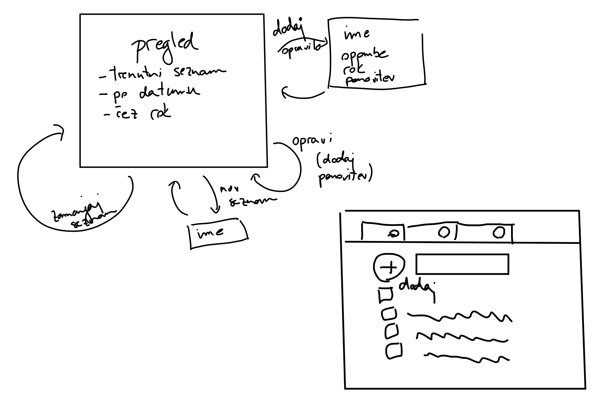
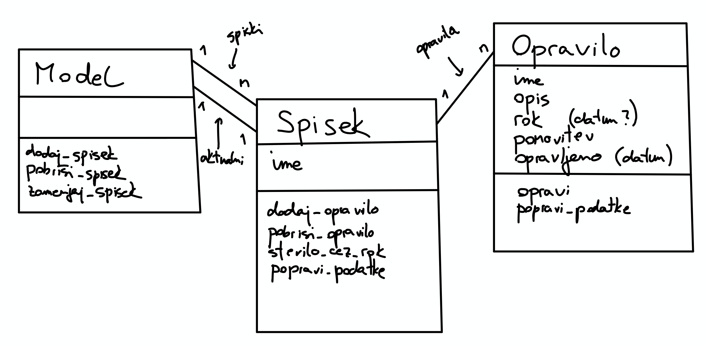

---
jupytext:
  cell_metadata_filter: -all
  formats: md:myst
  text_representation:
    extension: .md
    format_name: myst
    format_version: 0.13
    jupytext_version: 1.10.1
kernelspec:
  display_name: Python 3
  language: python
  name: python3
---

# *Tekstovni vmesnik

**Opomba:** Do vključno študijskega leta 2021/22 je bil del predmeta Uvod v programiranje tudi projektna naloga, ki je obsegala pisanje spletne storitve. Poglavja o tem so ostala v zapiskih, vendar so označena z *, saj niso več del učnega programa.

Za primer večjega programa v Pythonu bomo napisali enostaven program, ki nam bo omogočal beleženje opravil. Običajno je naš prvi instinkt, da poženemo urejevalnik kode in začnemo gledati, kako bi nastavili barvo gumbov. Vendar ta način običajno vodi v zmedeno kodo in posledično tudi neuporaben vmesnik, ki ga je zelo težko spreminjati. Zato se moramo stvari lotiti v pravem vrstnem redu in prvi korak je, da zapremo urejevalnik kode.

## Skica vmesnika

Nato na papir (ali na tablico) skiciramo, kaj pričakujemo od našega programa. Kakšen vmesnik bo ponujal, kam bodo izbire vodile uporabnika, … Ni treba, da je skica preveč natančna, važno je le, da na njej zajamemo vse, kar si v danem trenutku predstavljamo. Risanje je hitro in poceni, zato ni nič hudega, če s skico zgrešimo, saj jo vedno lahko popravimo. Primer skice, ki je nastala pred začetkom pisanja našega programa je:



## Skica modela

Tudi ko bo skica končana, se še ne bomo lotili pisanja vmesnika. Bolj pomembno je, da ugotovimo, kaj je naš _model_, torej predstavitev podatkov, s katerimi bomo delali. Če najprej model napišemo dobro, bo nudil trdno osnovo vmesniku (kot bomo videli celo več vmesnikom). Če pa se najprej lotimo vmesnika, bodo podatki zmešani z vmesnikom in ob prehodu na drug vmesnik (na primer iz tekstovnega na spletnega) bomo morali spremeniti veliko kode. Pri določitvi modela moramo ugotoviti, kaj so osnovni podatki, s katerimi želimo delati, in kakšne operacije bodo podpirali. Ker je Python objektni jezik, bomo vsako vrsto podatkov predstavili s svojim razredom. Pri določanju tega, katere atribute in metode mora vsebovati, nam bo v pomoč skica vmesnika.



Na skici označimo, katere razrede bomo imeli. Ker bomo beležili opravila, bomo vsekakor potrebovali razred `Opravilo`. Opravila bomo združevali v seznamih (domača opravila, službena opravila, …), katerih razred bomo poimenovali `Spisek`, da ne bo zmede s Pythonovimi seznami. Na koncu pa bomo potrebovali še krovni razred `Stanje`, ki bo zajemal vse podatke, ki jih potrebujemo za opis celotnega stanja. Vsak izmed razredov bo imel določene atribute, ki jih napišemo na vrhu, ter metode, ki jih napišemo na dnu. Povezav med razredi ne bomo pisali pod atribute, temveč jih bomo označili s povezavami na diagramu. Na vsaki povezavi si tudi zapišemo, koliko objektov je povezanih med seboj. Na primer, stanje ima lahko več spiskov, vendar le en aktualni spisek. Spisek ima eno stanje in več opravil.

## Implementacija modela

Na osnovi spiska zapišemo definicije ustreznih razredov. Najbolje, da kar v datoteko `model.py`. Ker bomo imeli opravka z roki opravil, si bomo pomagali z vgrajeno knjižnico [`datetime`](https://docs.python.org/3/library/datetime.html), ki med drugim ponuja razreda `date` za delo z datumi. Ko bomo implementirali metode, bomo opazili, da naša skica ni bila popolna (metod za popravljanje podatkov ne bomo rabili, na opravilih pa nam manjka metoda za ugotavljanje, ali je rok zamujen). Nič hudega, saj za skico nismo porabili preveč časa.

```{code-cell} ipython3
from datetime import date


class Stanje:
    def __init__(self):
        self.spiski = []
        self.aktualni_spisek = None

    def dodaj_spisek(self, spisek):
        self.spiski.append(spisek)
        if not self.aktualni_spisek:
            self.aktualni_spisek = spisek

    def pobrisi_spisek(self, spisek):
        self.spiski.remove(spisek)

    def zamenjaj_spisek(self, spisek):
        self.aktualni_spisek = spisek

    def dodaj_opravilo(self, opravilo):
        self.aktualni_spisek.dodaj_opravilo(opravilo)

    def pobrisi_opravilo(self, opravilo):
        self.aktualni_spisek.pobrisi_opravilo(opravilo)


class Spisek:
    def __init__(self, ime):
        self.ime = ime
        self.opravila = []

    def dodaj_opravilo(self, opravilo):
        self.opravila.append(opravilo)

    def stevilo_zamujenih(self):
        stevilo = 0
        for opravilo in self.opravila:
            if opravilo.zamuja():
                stevilo += 1
        return stevilo

    def stevilo_vseh(self):
        return len(self.opravila)


class Opravilo:
    def __init__(self, ime, opis, rok, opravljeno=False):
        self.ime = ime
        self.opis = opis
        self.rok = rok
        self.opravljeno = opravljeno

    def opravi(self):
        self.opravljeno = True

    def zamuja(self):
        rok_pretekel = self.rok and self.rok < date.today()
        return not self.opravljeno and rok_pretekel
```

## Implementacija vmesnika

Ko je model v osnovi napisan, se lahko lotimo vmesnika. Za začetek se bomo lotili tekstovnega vmesnika, ki bo uporabniku izpisal trenutni prikaz ter s konzole prebral njegova navodila. Da bomo dobro poskrbeli za ločitev od modela, bomo vmesnik napisali v ločeno datoteko `tekstovni_vmesnik.py`. Paziti moramo, da iz vmesnika do modela dostopamo prek metod, saj bo tako celotno vedenje definirano v `model.py`. Prav tako je treba paziti, da iz modela nikoli ne dostopamo do vmesnika. To enostavno preprečimo tako, da se v `model.py` nikoli ne skličemo na datoteko `tekstovni_vmesnik.py`. Ker sta obe datoteki v istem imeniku, lahko model uvozimo kar kot:

```python
from model import Stanje

stanje = Stanje()
```

Za začetek bo naše stanje prazno, kmalu pa si bomo pogledali, kako ga shranimo v datoteko in kasneje preberemo nazaj. Pisanja vmesnika se lotimo _od zgoraj navzdol_. Začnemo z osnovno zanko, ki bo pokazala pozdravno sporočilo, nato pa v nedogled uporabniku ponujala osnovni zaslon. Zato bo osnovna funkcija sledeča:

```python
def tekstovni_vmesnik():
    prikazi_pozdravno_sporocilo()
    while True:
        osnovni_zaslon()
```

Osnovni zaslon bo najprej pokazal aktualna opravila, nato pa prebral ukaz in odvisno od njega poklical naslednjo funkcijo:

```python
DODAJ_OPRAVILO = 'dodaj'
OPRAVI_OPRAVILO = 'opravi'

def osnovni_zaslon():
    prikazi_aktualna_opravila()
    ukaz = preberi_ukaz()
    if ukaz == DODAJ_OPRAVILO:
        dodaj_opravilo()
    elif ukaz == OPRAVI_OPRAVILO:
        opravi_opravilo()
    ...
```

Vsak ukaz bomo predstavili s svojim nizom. Da se ne bomo zatipkali in npr. v funkciji `osnovni_zaslon` pisali `'dodaj'`, v funkciji `preberi_ukaz` pa `'Dodaj'`, bomo ukaze shranili v konstante, ki so običajne spremenljivke, vendar s samimi velikimi črkami označujemo, da njihovih vrednosti ne bomo spreminjali. Če se bomo zatipkali pri pisanju imena konstante, nas bo na to opozoril urejevalnik.

Funkcije bomo tako drobili naprej, na ustreznih točkah pa bomo poklicali metode na modelu. Na primer:

```python
def dodaj_opravilo():
    ime = input('Ime opravila> ')
    ...
    opravilo = Opravilo(ime, ...)
    stanje.aktualni_spisek.dodaj_opravilo(opravilo)
```

## Shranjevanje stanja

Da ne bomo ob zaprtju programa izgubili vseh podatkov, si jih bomo pred zaprtjem shranili v datoteko, ki jo bomo ob vsakem zagonu prebrali. Tako bo naš vmesnik sledeče oblike:

```python
from stanje import Stanje

IME_DATOTEKE = 'stanje.json'
stanje = Stanje.preberi_iz_datoteke(IME_DATOTEKE)

...

def osnovni_zaslon():
    while True:
        ...
        elif ukaz == ZAKLJUCI:
            stanje.shrani_v_datoteko(IME_DATOTEKE)
            print('Nasvidenje!')
            break         
```

Da ne bomo izumljali tople vode, si bomo stanje zapisali v JSON datoteko. Ker Python našega stanja ne zna samodejno spremeniti v JSON, bomo sami napisali vmesno pretvorbo v slovar. Vse naše objekte moramo tako dopolniti z metodami za pretvorbo v slovar in iz slovarja. Prve bodo običajne metode, ki bodo vrnile slovar, na primer:

```python
class Spisek:
    ...
    
    def v_slovar(self):
        return {
            "ime": self.ime,
            "opravila": [opravilo.v_slovar() for opravilo in self.opravila],
        }


class Opravilo:
    ...
    
    def v_slovar(self):
        return {
            "ime": self.ime,
            "opis": self.opis,
            "rok": date.isoformat(self.rok) if self.rok else None,
            "opravljeno": self.opravljeno,
        }
```

Metode za pretvorbo iz slovarja pa so malo bolj posebne, saj pred trenutkom, ko preberemo slovar, še nimamo objekta, na katerih bi jih poklicali. Lahko bi si sicer napisali funkcije kot so `preberi_opravilo_iz_slovarja` ali `preberi_spisek_iz_slovarja`, vendar te funkcije zelo naravno spadajo v ustrezne razrede. Hkrati pa niso metode, saj nimajo objekta, na katerih jih lahko pokličemo. Gre za _statične metode_, ki so v resnici navadne funkcije, le da jih kot metode zapišemo v razred in na vrhu označimo s `@staticmethod` (v resnici bi bilo boljša možnost `@classmethod`, ampak o tem kdaj drugič):

```python
class Spisek:
    ...
    
    @staticmethod
    def iz_slovarja(slovar):
        spisek = Spisek(slovar["ime"])
        spisek.opravila = [
            Opravilo.iz_slovarja(sl_opravila) for sl_opravila in slovar["opravila"]
        ]
        return spisek


class Opravilo:
    ...
    
    @staticmethod
    def iz_slovarja(slovar):
        return Opravilo(
            slovar["ime"],
            slovar["opis"],
            date.fromisoformat(slovar["rok"]) if slovar["rok"] else None,
            slovar["opravljeno"],
        )
```

Opremljeni z vsemi funkcijami lahko shranjevanje in nalaganje stanja napišemo kot:

```python
import json

class Stanje:
    ...
    
    def shrani_v_datoteko(self, ime_datoteke):
        with open(ime_datoteke, 'w') as dat:
            slovar = self.v_slovar()
            json.dump(slovar, dat)
    
    @staticmethod
    def preberi_iz_datoteke(ime_datoteke):
        with open(ime_datoteke) as dat:
            slovar = json.load(dat)
            return Stanje.iz_slovarja(slovar)
